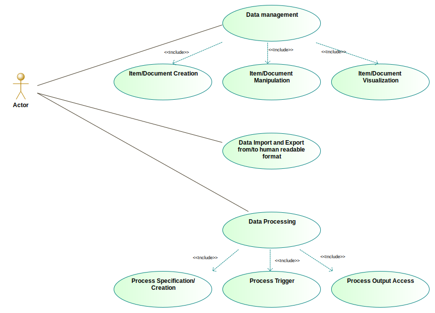
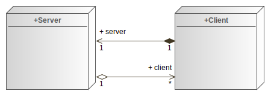
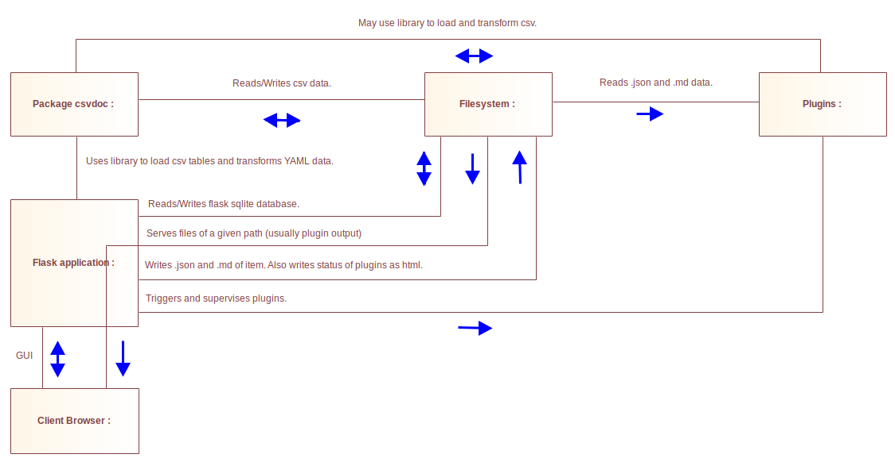
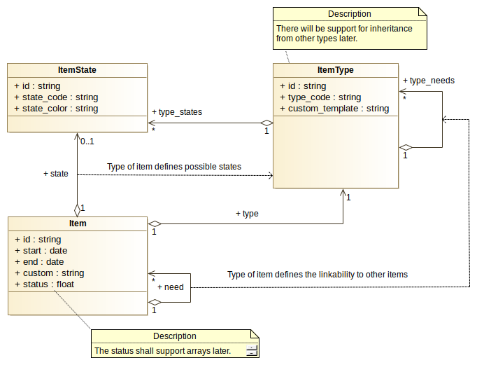
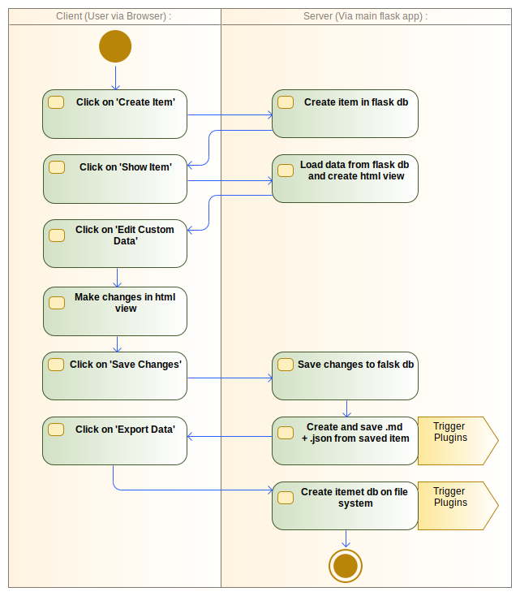

# Itemet SW-Documentation

## Use cases

Itemet aims to be a tool to create, link and modify
markdown documents with YAML front matter.
The resulting use cases are visualized in the next graphic.

## System Architecture

To provide a central multi user platform, a server-client architecture is implemented.

The application consists of 3 main modules:

+ flask application (main server application)
+ package csvdoc (a human readable database)
+ plugins (user-defined functions to use itemet data)

The basic communication is shown in next graphic.

## Data Model

Each item contains the following data fields:

+ code (unique identification code)
+ type (type of item)
+ need (links to needed items)
+ state (state of item)
+ start (date time ISO 8601)
+ end (date time ISO 8601)
+ status (a numerical floating value)
+ custom data (markdown document with data points in YAML front matter)

### Document representation of Items

All data fields except 'custom data' are called 'base' data.
In itemet, this data is used as a common interface for all documents.
An item can be understood as a different representation of a document.
To get the document representation of the item,
the data points in the YAML front matter of the custom data field
are extended by the 'base' data fields.

### Item Types

Item types are used to keep control over the links, states
and data points in the YAML front matter of each item.
A type defines:

+ which states an item can assume
+ which data points can be included in YAML front matter
+ which items of one type can be linked to items of a another type

### Full Data Model

## Usage

With the described application the following usage example is possible.

